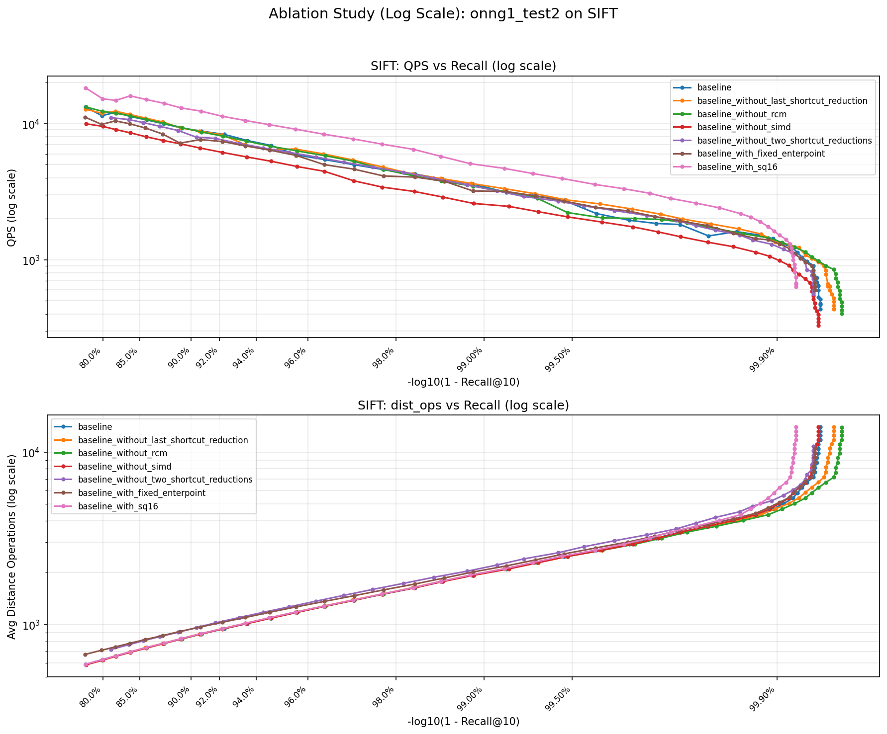
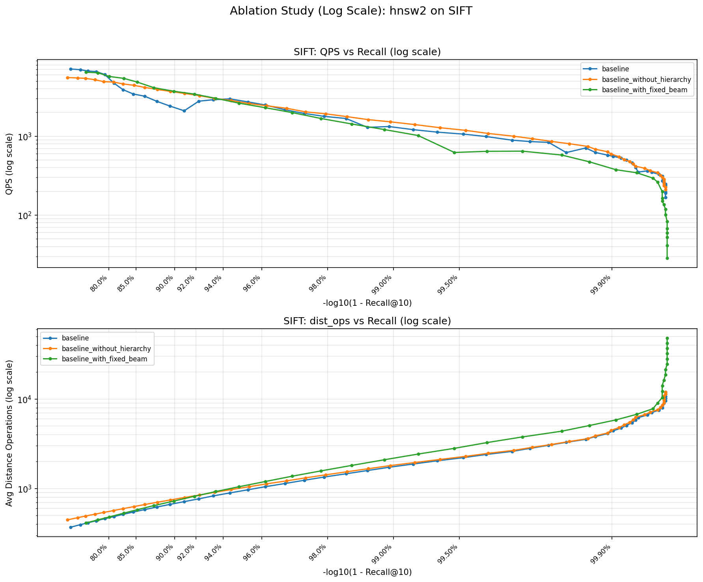
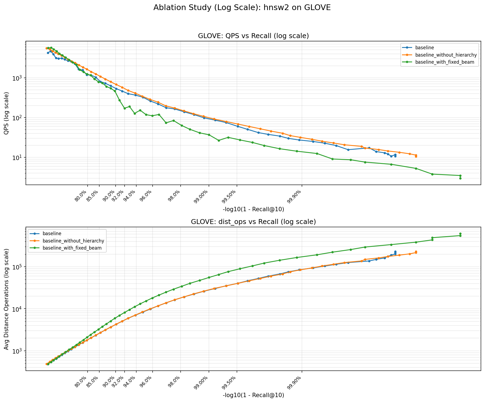
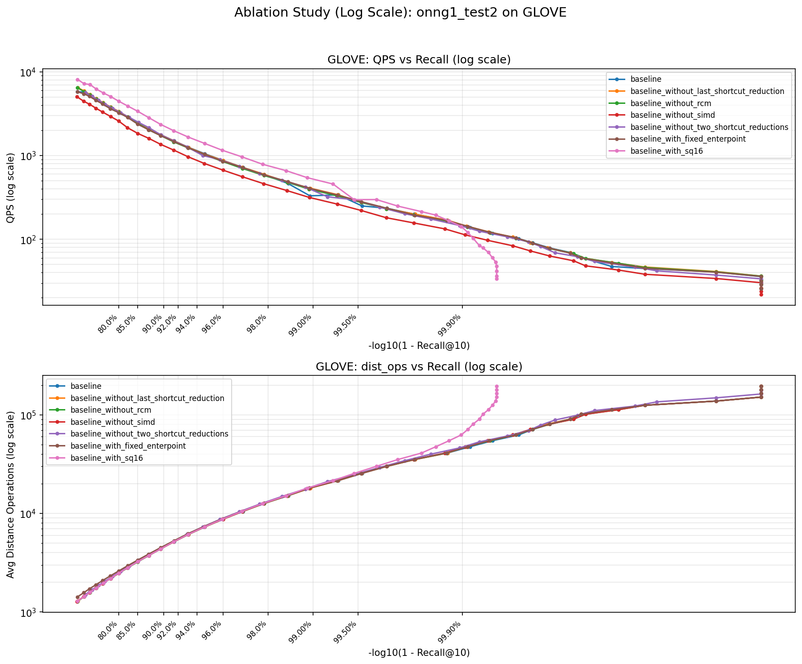

# ANN - Approximate Nearest Neighbor Search

A comparative study of multiple Approximate Nearest Neighbor (ANN) search algorithms, implementing and benchmarking various graph-based approaches including HNSW, FlatNav, and ONNG.

## Overview

This project implements 30+ variants of ANN algorithms to find the K nearest neighbors in high-dimensional vector spaces. It is meant as a convenient sandbox: drop in your own ANN code, run a one-liner, and instantly compare build/search speed and recall against the bundled baselines.

## Algorithms Implemented

| Algorithm | Description | Location | Type |
|-----------|-------------|----------|------|
| Brute Force | Exact search baseline (O(n)) | `method/bruteforce/` | Custom |
| HNSW | Hierarchical Navigable Small World (multi-layer) | `method/hnsw1/` | Custom |
| HNSW + Adaptive Search | HNSW with NGT's adaptive search strategy | `method/hnsw2/` | Custom |
| FlatNav | Single-layer HNSW graph | `method/flatnav*/` | Custom |
| ONNG | FlatNav + ONNG edge pruning | `method/onng*/` | Custom |
| hnswlib | Official hnswlib library | `method/hnswlib/` | Library |
| flatnavlib | Official FlatNav library | `method/flatnavlib/` | Library |

### Implementation Notes

**FlatNav**: A single-layer variant of HNSW where `random_level()` always returns 0. This simplifies the graph structure while maintaining the core navigation properties.

**ONNG**: Built on top of FlatNav (single-layer graph), with the addition of an **edge pruning (shortcut reduction) strategy** adapted from [NGT](https://github.com/yahoojapan/NGT)'s `adjustPathsEffectively`.

**HNSW2**: Uses NGT's **adaptive search strategy** with a `gamma` parameter to control early termination based on the ratio between current candidate distance and the worst distance in the result set.

**Important**: The edge pruning primarily affects graph storage size and cache efficiency. It does **not significantly reduce the number of distance computations** during search. The `onng1_test2_sq16_2` directory contains a pure single-layer graph **without** edge pruning for comparison.

### Optimizations

-   **SIMD**: Vectorized distance computation (`flatnav1_SIMD/`). **Note**: This implementation is x86-specific.
-   **Multi-threading**: Parallel search (`flatnav1_threads*/`).
-   **Graph Reordering**: G-order, RCM optimization (`flatnav1_threads1_gorder/`, `flatnav1_threads1_rcm/`).
-   **Quantization**: SQ8, SQ16 compression (`onng1_test2_sq*/`).

## Datasets

| Dataset | Base Vectors | Dimensions | Queries | Note |
|---------|--------------|------------|---------|------|
| SIFT | 1,000,000 | 128 | 10,000 | |
| GLOVE | 1,183,514 | 100 | 10,000 | Normalized, L2 distance |
| DEBUG | 1,000 | 16 | 100 | |

> **Note**: Only binary format (`.bin`) files are included in this repository. Text format (`.txt`) files are excluded due to large file size (~800MB). You can convert between formats using the scripts in `checker/`.

## Performance Results

### SIFT Dataset (1M vectors, 128-dim, 10K queries)

| Method | Search Latency (ms) | Recall@10 | Pass |
|--------|---------------------|-----------|------|
| Brute Force | 128.45 | 99.94% | ✓ |
| HNSW (hnsw1) | 1.27 | 99.57% | ✓ |
| HNSW + Adaptive (hnsw2) | 1.32 | 99.84% | ✓ |
| FlatNav | 1.36 | 99.84% | ✓ |
| FlatNav + SIMD | 1.09 | 99.84% | ✓ |
| FlatNav + Threads | 0.66 | 99.89% | ✓ |
| FlatNav + RCM | 0.54 | 99.86% | ✓ |
| FlatNav + RCM + Path | 0.43 | 99.57% | ✓ |
| ONNG | 0.36 | 99.28% | ✓ |
| ONNG (onng1_test2) | 0.33 | 99.33% | ✓ |
| ONNG + SQ16 | 0.24 | 99.32% | ✓ |
| No Pruning (onng1_test2_sq16_2) | 0.39 | 99.54% | ✓ |

### GLOVE Dataset (1.18M vectors, 100-dim, 10K queries)

| Method | Search Latency (ms) | Recall@10 | Pass |
|--------|---------------------|-----------|------|
| Brute Force | 133.90 | 100.00% | ✓ |
| HNSW (hnsw1) | 1.74 | 86.71% | ✗ |
| HNSW + Adaptive (hnsw2) | 11.67 | 99.14% | ✓ |
| FlatNav | 11.79 | 99.12% | ✓ |
| FlatNav + Threads | 5.86 | 99.24% | ✓ |
| FlatNav + RCM + Path | 3.93 | 99.31% | ✓ |
| ONNG | 3.47 | 99.13% | ✓ |
| ONNG (onng1_test2) | 3.06 | 99.32% | ✓ |
| ONNG + SQ16 | 2.12 | 99.26% | ✓ |
| No Pruning (onng1_test2_sq16_2) | 2.78 | 99.42% | ✓ |

> **Note**: GLOVE vectors are normalized, so L2 distance is used. This is a harder dataset - standard HNSW without adaptive search fails to reach 99% recall.

## Project Structure

```
.
|-- method/           # Algorithm implementations
|   |-- bruteforce/   # Baseline brute force search
|   |-- hnsw*/        # HNSW variants (custom)
|   |-- flatnav*/     # FlatNav variants (custom)
|   |-- onng*/        # ONNG variants (custom)
|   |-- hnswlib/      # Library baseline (official hnswlib)
|   `-- flatnavlib/   # Library baseline (FlatNav + Cereal/RapidJSON)
|-- ablation/         # Ablation study variants
|   |-- hnsw2/        # HNSW ablation experiments
|   `-- onng1_test2/  # ONNG ablation experiments
|-- checker/          # Basic evaluation tools
|-- checker1/         # High-precision evaluation
|-- checker2/         # Ablation study framework
|   |-- evaluate.cpp  # Ablation evaluation program
|   |-- run_eval.bat  # Windows script
|   `-- plot_ablation.py  # Result visualization
`-- data/             # Datasets (binary format)
    |-- sift/
    |-- glove/
    `-- debug/
```

### Checkers

- `checker/` — baseline evaluation harness; focuses on core build/search timing and Recall@10 gate (>=0.99).
- `checker1/` — same harness but with higher-precision distance handling for all graph algorithms; still being completed.
- `checker2/` — ablation study framework with parameter sweeping (gamma/efSearch), graph caching, and detailed statistics collection.

## Ablation Studies

The `ablation/` directory contains controlled experiments to measure the impact of individual algorithm components.

### HNSW2 Ablation (`ablation/hnsw2/`)

| Variant | Description |
|---------|-------------|
| `baseline` | Full HNSW with adaptive gamma search |
| `baseline_with_fixed_beam` | Fixed efSearch instead of adaptive gamma |
| `baseline_without_hierarchy` | Single-layer graph (FlatNav-like) |

### ONNG Ablation (`ablation/onng1_test2/`)

| Variant | Description |
|---------|-------------|
| `baseline` | Full precision float (base) |
| `baseline_with_sq16` | Add SQ16 quantization |
| `baseline_with_fixed_enterpoint` | Remove 100-point entry scan |
| `baseline_without_last_shortcut_reduction` | Remove second edge pruning pass |
| `baseline_without_rcm` | Remove RCM graph reordering |
| `baseline_without_simd` | Force scalar distance computation |
| `baseline_without_two_shortcut_reductions` | Remove all edge pruning |

We performed extensive ablation studies to isolate the impact of each optimization technique.

### Findings
The chart below demonstrates the performance breakdown on the SIFT-1M dataset. The **SQ16 quantization** (Pink line) provides the most significant boost in QPS while maintaining high recall.

*Figure: QPS vs Recall (Log Scale) on SIFT-1M. Note how SQ16 dominates the high-recall regime.*

### Detailed Analysis

**HNSW2 on SIFT (Impact of Hierarchy & Beam Search)**


**HNSW2 on GLOVE (Harder Dataset)**


**ONNG on SIFT (Impact of SQ16, SIMD, RCM)**


**ONNG on GLOVE**


### Benchmark Environment

- **CPU**: Intel Core i5-1135G7 @ 2.40GHz (Tiger Lake)
- **Cores**: 4 Cores, 8 Logical Processors
- **Cache**: L2 5.0 MB / L3 8.0 MB
- **OS**: Windows (Virtualization Enabled)

> **Note**: All benchmarks were run on this single-node environment.

### Benchmarking Best Practices

To achieve minimal variance and reproduce the strict latency numbers reported above, we recommend the following environment configuration. While not mandatory, these steps prevent OS scheduling jitter and thermal throttling.


#### 1. BIOS Configuration (Reduce Jitter)
*   **Disable Hyper-Threading**: Reduces L1/L2 cache contention.
*   **Disable Turbo Boost / SpeedStep / C-States**: Prevents frequency scaling and context switching delays.
*   **Fix CPU Frequency**: Lock the CPU to its base frequency (or a static high performance state).

#### 2. Preparation
*   Close all unnecessary background applications.
*   (Optional) Reboot to ensure a clean OS state.

#### 3. Restoration
*   **Important**: Remember to re-enable Hyper-Threading and dynamic frequency scaling in BIOS after benchmarking to restore full system performance for daily usage.

### Running Ablation Experiments

```bash
cd checker2

# Run single variant
.\run_eval.bat hnsw2\baseline DEBUG

# Run all variants
.\run_eval.bat hnsw2\baseline;.\run_eval.bat hnsw2\baseline_with_fixed_beam;...

# Plot results
python plot_ablation.py hnsw2 SIFT
```

**Features:**
- **Graph caching**: Built graphs are saved to `graph_*.bin` for reuse
- **Checkpoint resume**: If interrupted, evaluation resumes from the last completed parameter
- **Parameter sweep**: Automatically sweeps gamma (0.00-0.50) or efSearch (10-91004)

## Quick Start

### Prerequisites

- C++17 compatible compiler (g++ recommended)
- Python 3.8+ (for data processing scripts)

### Build and Run

```bash
# Navigate to checker directory
cd checker

# Run evaluation for a specific method
# Windows:
.\run_eval.bat hnsw1

# Linux:
./run_eval.sh hnsw1
```

> Why does DEBUG run twice in `checker/evaluate.cpp`? During early development we intentionally evaluate the small DEBUG set two times back-to-back. The duplicate pass makes silent crashes or uninitialized-state bugs surface earlier (e.g., use-after-free after the first loop). The lighter `checker1` variant drops this double-run to save a few seconds when you just need a clean pass.

### Data Format

- **Binary format** (`.bin`): Optimized for fast loading
- **Text format** (`.txt`): Human-readable, one vector per line

## Implementing Your Own Algorithm

1. Create a new directory under `method/`
2. Implement `MySolution.h` and `MySolution.cpp` with the required interface:

```cpp
class MySolution {
public:
    void build(const std::vector<std::vector<float>>& base);
    std::vector<int> search(const std::vector<float>& query, int k);
};
```

3. Run evaluation: `.\run_eval.bat your_method_name`

## Dependencies

This project includes or references the following open-source libraries:

| Library | Usage | License | Location |
|---------|-------|---------|----------|
| [hnswlib](https://github.com/nmslib/hnswlib) | HNSW reference implementation | Apache-2.0 | `method/hnswlib/` |
| [FlatNav](https://github.com/BlaiseMuhworworker/flatnav) | FlatNav reference implementation | MIT | `method/flatnavlib/` |
| [Cereal](https://github.com/USCiLab/cereal) | Serialization | BSD-3-Clause | `method/flatnavlib/cereal/` |
| [RapidJSON](https://github.com/Tencent/rapidjson) | JSON parsing | MIT | `method/flatnavlib/cereal/external/rapidjson/` |

## License

This project is licensed under the MIT License - see the [LICENSE](LICENSE) file for details.

## Acknowledgments

- SIFT Dataset: [Corpus-Texmex](http://corpus-texmex.irisa.fr/)
- GloVe dataset: [Stanford NLP](https://nlp.stanford.edu/projects/glove/)
- AI assistants: [Claude](https://claude.ai/) (Anthropic), [Gemini](https://gemini.google.com/) (Google)
